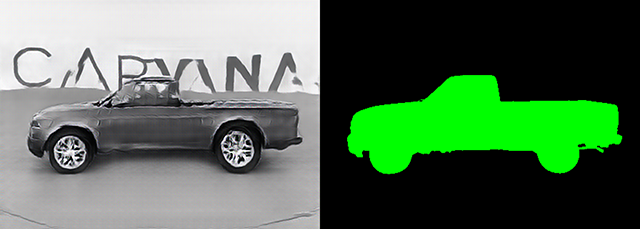

# ai-car-generator
Generate car images from segmentation maps using the carvana dataset.

## Model Architecture
This model was trained to generate a synthetic image of a car from a segmentation map using a pix2pixHD conditional generative adversarial network (CGAN).
## Dataset 
For this project we use the single car image segmentation dataset - Carvana Image Masking (PNG) https://www.kaggle.com/datasets/ipythonx/carvana-image-masking-png. 
## Data preperation
The entire dataset contains 5088 image-mask pairs and the dimensions of each image are 448x320 pixels. Since this model is intended for initial testing, we decided to use a subset of 701 pairs for quicker fine-tuning.
We created an imageDatastore and a pixelLabelDatastore to store the images and the pixel label images repectively.
### Class names, label IDs and Colormaps
We defined the class names and pixel label IDs for the two classes, car and background, in the Carvana dataset using the helper function define2ClassesAndPixelLabelIDs. Additionally, we generated a standard colormap for the dataset with the helper function 2ColorMap. Both helper functions are included as supporting files in the example.
### Partion of the data for training and testing
We partitioned the data into training and test sets using the helper function partitionForPix2PixHD.
### Training data augmentation
We performed the following preprocessing steps to augment the data for training:
- Scaled the ground truth data to the range [-1, 1], aligning it with the range of the final `tanhLayer` in the generator network.
- Resized the images and labels to the network's output size of **576-by-768 pixels** using bicubic downsampling for images and nearest-neighbor downsampling for labels.
- Converted the single-channel segmentation map into a 32-channel one-hot encoded segmentation map using the `onehotencode` function.
- Randomly applied horizontal flipping to the image and pixel label pairs to augment the dataset.
## Model Training
### Generator Network Configuration
We define a pix2pixHD generator network that converts a depth-wise one-hot encoded segmentation map (number of channels = number of classes in the segmentation) into a scene image. Our input maintains the same height and width as the original segmentation map.
### Discriminator Network Configuration
We define PatchGAN discriminator networks to classify an input image as either real (1) or fake (0). In this example, we use two multiscale discriminators operating at different input scales: one at the original image size and another at half the image size.
The input to each discriminator is the depth-wise concatenation of the one-hot encoded segmentation map and the scene image being classified. The total number of input channels for the discriminator is determined by the sum of the labeled classes in the segmentation map and the color channels of the image.
### Model Gradient and Loss Functions
#### Generator Loss
The overall generator loss is a weighted sum of all three losses. λ1, λ2, and λ3 are the weight factors for adversarial loss, feature matching loss, and perceptual loss, respectively:
- lossGenerator=λ1∗lossAdversarialGenerator+λ2∗lossFeatureMatching+λ3∗lossPerceptual
## Model Evaluation
## Deployment
